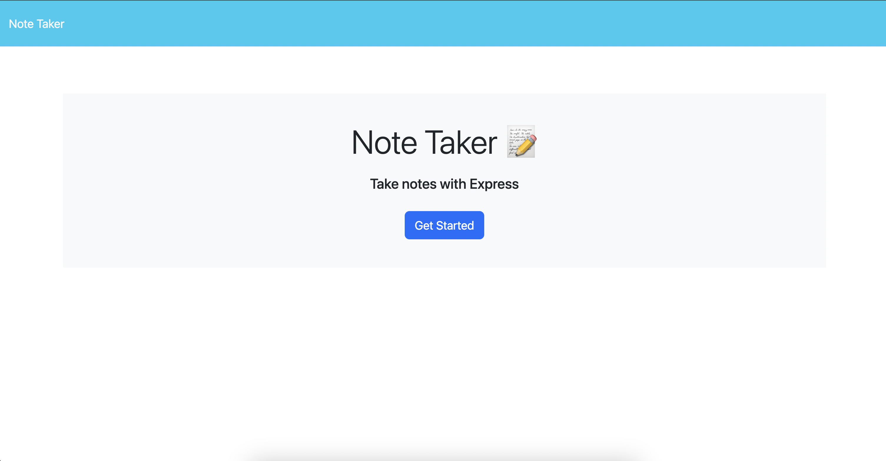
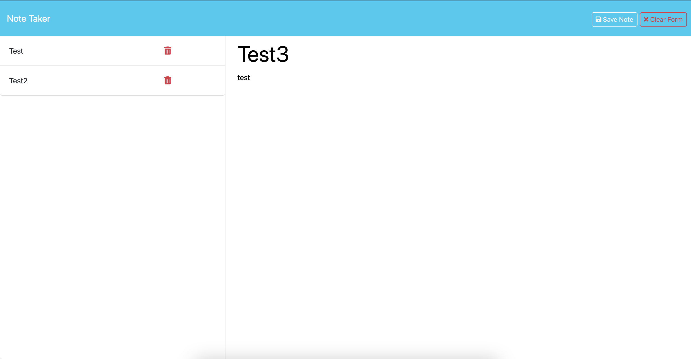

# note-taker-express-js
## Description
* This Note Taker website, built using Express.js, allows users to efficiently create, view, and delete notes. It's a simple and intuitive application designed to help you keep track of important information and tasks.

## Installation
* Install dependencies: ```npm install```
* Start the server: ```node server.js```

## Application Page
* 
* 

## Links 
* [Github Repository](https://github.com/veyselarslan12/note-taker-express-js)
* [Deployment Website Link](https://note-taker-express-js-7wps.onrender.com)